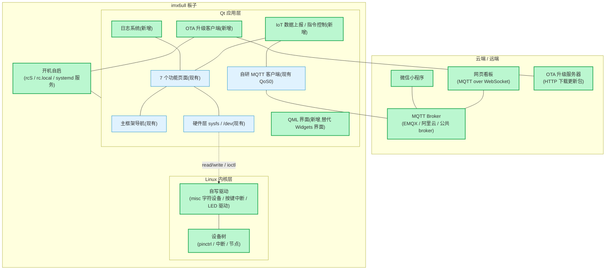

# imx6ull 项目升级计划

> 日期:2026-08-09
> 状态:计划阶段,未开始实现
> 范围:4 个独立功能组(日志/开机自启、MQTT 上云+看板、OTA、自写驱动+设备树、QML 重写)

---

## 1. 背景与目标

当前项目是 imx6ull 嵌入式 Linux Qt 应用(7 个功能模块、22 个自动化测试、x86/ARM 双平台构建)。为了提升面试竞争力和产品完整度,计划分阶段加入以下能力:

1. 日志系统 + 开机自启(工程化地基)
2. MQTT 上云 + 网页/小程序远程控制和数据看板(IoT 全栈)
3. OTA 升级(产品化)
4. 自写 Linux 驱动 + 设备树(嵌入式底层)
5. QML 界面重写 + 多语言 + 主题切换(GUI 深度)

**原则:**

- 每个功能组独立设计、独立实现、独立验证,不在一个分支里混做。
- 不破坏现有 7 个模块和 22 个测试。
- 每一项完成标准 = 功能在 Windows x86 验证 + 板端 Linux 验证 + 文档记录。

---

## 2. 现状架构(已有)

```text
Qt 应用层
├── main.cpp / mainwidget(顶部导航 + QStackedWidget)
├── form/         7 个页面(轮播图/OpenCV/人脸/板级设备/音乐/视频/MQTT)
├── hardware/     LED(led)、AP3216C、ICM20608、Camera(路径可注入)
├── lib/          simplemqtt(自研 MQTT 3.1.1,QoS0)
├── style/ images/  qss 与资源(qrc 编译进 exe)
└── myMusic/ myVideo/ opencv_src/  运行时资源目录

构建与部署
├── x86/build.cmd                Windows 本机构建
├── tests/build_tests.cmd        自动化测试
├── build_arm.sh / deploy_sd.sh  Ubuntu 交叉编译 + SD 卡部署
└── scripts/generate_icons.py    图标生成
```

---

## 3. 目标结构图(绿色 = 新增,蓝色 = 现有)



---

## 4. 功能组一:日志系统 + 开机自启

### 目标

- 程序所有 qDebug/qWarning/qCritical 输出写入日志文件,支持按大小轮转。
- 板子上电自动启动应用,带完整的运行环境变量。

### 模块设计

```text
system/log/
├── logmanager.h / .cpp      qInstallMessageHandler 实现
└── logmanager.pri

scripts/
├── run_project.sh           设置 QT_QPA_PLATFORM / LD_LIBRARY_PATH 后启动
└── install_autostart.sh     安装开机自启(busybox 用 rcS/rc.local;systemd 生成 .service)
```

### 新增/改动文件

| 类型 | 路径 | 说明 |
|---|---|---|
| 新增 | `system/log/logmanager.*` | 日志管理器 |
| 新增 | `scripts/run_project.sh` | 板端启动脚本 |
| 新增 | `scripts/install_autostart.sh` | 安装自启 |
| 新增 | `deploy/autostart/project.service` | systemd 服务(若板端用 systemd) |
| 改动 | `project/main.cpp` | 初始化 LogManager |
| 改动 | `.gitignore` | 忽略 logs/ |

### 准备事项

- 确认板子 rootfs 是 busybox init 还是 systemd(`ls /sbin/init`、`ps -p 1`)。
- 了解 Qt `qInstallMessageHandler` 与文件轮转(按大小或按天)。

### 实施步骤(概要)

1. 实现 LogManager:时间戳 + 级别 + 文件写入 + 5MB/个、最多 3 个文件轮转。
2. 在 main.cpp 启动时初始化,日志目录默认 `logs/`。
3. 写 `run_project.sh`(含环境变量),本机验证。
4. 按板端 init 类型安装自启,重启板子验证。
5. 验证:重启后进程存在、日志文件生成、轮转生效。

### 验收标准

- 无头/无显示环境下日志仍写入。
- 板子断电重启后程序自动运行。
- 现有 22 个测试全部通过(日志模块不破坏现有逻辑)。

---

## 5. 功能组二:MQTT 上云 + 网页/小程序远程控制和数据看板

### 目标

- 板子传感器数据(LED 状态、AP3216C、ICM20608)定时上报云端。
- 网页/小程序可以远程控制 LED/蜂鸣器,并查看实时曲线。

### 模块设计

```text
应用层新增
project/iot/
├── iotservice.h / .cpp        数据上报、指令订阅、JSON 解析
└── iot.pri

云端
├── broker                    EMQX(本地/云服务器)或公共 broker
├── web/                      HTML + MQTT.js(WebSocket)看板
└── miniprogram/              微信小程序(可选,需 HTTPS 域名)

主题约定
├── device/{id}/sensor/status   板子上报(JSON)
├── device/{id}/control         下发指令(JSON: {"led":1})
└── device/{id}/online          在线状态(LWT)
```

### 新增/改动文件

| 类型 | 路径 | 说明 |
|---|---|---|
| 新增 | `project/iot/iotservice.*` | IoT 服务 |
| 新增 | `web/index.html` + `web/app.js` | 网页看板 |
| 新增 | `miniprogram/`(可选) | 小程序端 |
| 新增 | `docs/iot-协议.md` | 主题与 JSON 协议定义 |
| 改动 | `project/form/mqtt_client.cpp` | 与 IoT 服务联动(可选) |
| 改动 | `project/project.pro` | include iot.pri |

### 准备事项

- 板子联网(有线 + DHCP/DNS,见《联网指南》)。
- 一个可用 broker:公共 `broker.emqx.io`(1883/8083 WebSocket)或自己部署 EMQX。
- JSON 处理:Qt 自带 QJsonDocument,无需第三方库。
- 小程序需要备案域名 + WSS,先不做小程序、用网页即可。

### 实施步骤(概要)

1. 定义主题与 JSON 协议文档。
2. 实现 IotService:定时(默认 2s)上报传感器 JSON;订阅 control 主题解析指令控制 LED。
3. 网页看板用 MQTT.js over WebSocket 订阅 sensor/status 画曲线、发控制指令。
4. 板端与网页联调;接入公共 broker 验证跨设备通信。
5. (可选)部署 EMQX 到云服务器,配置账号密码。

### 验收标准

- 网页能看到实时传感器曲线。
- 网页点击按钮,板子 LED 实际亮灭。
- 板子断网时 broker 显示离线(LWT)。

---

## 6. 功能组三:OTA 升级

### 目标

- 应用支持远程检查版本、下载更新包、校验、原子切换、失败回滚。

### 模块设计

```text
project/ota/
├── otaclient.h / .cpp          版本检查/下载/校验/切换
└── ota.pri

升级包规范
├── version.json               {"version":"1.2.0","url":"...","md5":"..."}
└── project_v1.2.0.tar.gz      app 可执行文件 + 资源目录

板端目录布局
├── /home/root/project/         当前版本(symlink)
├── /home/root/project_v1.1.0/  旧版本
└── /home/root/project_v1.2.0/  新版本
```

### 新增/改动文件

| 类型 | 路径 | 说明 |
|---|---|---|
| 新增 | `project/ota/otaclient.*` | OTA 客户端 |
| 新增 | `scripts/ota_server/` | 升级服务器目录(version.json + 包) |
| 新增 | `scripts/apply_update.sh` | 板端解压/切换/回滚脚本 |
| 改动 | `project/main.cpp` | 启动时检查版本 |
| 改动 | `project/project.pro` | include ota.pri |

### 准备事项

- 一个 HTTP 服务器(nginx/python -m http.server)放更新包。
- 版本号规范:主.次.修订,写入编译宏或外部文件。
- Linux 符号链接切换与失败回滚思路。

### 实施步骤(概要)

1. 实现版本检查(QNetworkAccessManager 请求 version.json)。
2. 下载到临时目录 → 校验 md5。
3. 调用 apply_update.sh 解压到新版本目录 → 切换 symlink → 重启应用。
4. 新版本启动后上报版本号;启动失败(看门狗/超时)自动切回旧版本。
5. 验证:发布 1.1.0 → 板子自动升级 → 断电重启仍为新版;伪造坏包验证回滚。

### 验收标准

- 手动发布新版本后,板子 1 分钟内完成升级。
- 坏包/断网不破坏当前版本。
- 升级失败能自动回滚。

---

## 7. 功能组四:自写 Linux 驱动 + 设备树

### 目标

- 在内核层实现 misc 字符设备(控制 LED)、按键中断驱动,并修改设备树。
- 应用层可改用 ioctl/read 访问自定义设备(保留 sysfs 兼容)。

### 模块设计

```text
kernel_drivers/
├── imx6ull_led/               misc 驱动:open/release/ioctl(LED on/off)
├── imx6ull_key/               按键中断:request_irq / input 子系统上报事件
└── dts/                       设备树节点 + pinctrl 配置

设备节点
├── /dev/imx6ull_led
└── /dev/imx6ull_key
```

### 新增/改动文件

| 类型 | 路径 | 说明 |
|---|---|---|
| 新增 | `kernel_drivers/imx6ull_led/` | LED misc 驱动源码 + Makefile |
| 新增 | `kernel_drivers/imx6ull_key/` | 按键中断驱动源码 + Makefile |
| 新增 | `kernel_drivers/dts/` | 设备树片段(pinctrl、节点) |
| 新增 | `docs/驱动笔记.md` | 驱动原理、编译、烧录记录 |
| 改动 | 应用 `hardware/led.cpp` | 可选:新增 ioctl 访问方式 |

### 准备事项

- 正点原子内核源码(如 linux-imx 4.1.15)与交叉编译环境。
- 设备树语法、pinctrl、中断(按键消抖)、misc 框架、ioctl。
- 会重新编译 zImage/dtb 并烧写 SD 卡 boot 分区(先备份可用 SD)。

### 实施步骤(概要)

1. 写 LED misc 驱动(register_chrdev/misc_register + ioctl),先编译成 .ko 加载验证。
2. 写按键中断驱动(request_irq + 消抖 + input 上报),dmesg 验证中断。
3. 修改设备树(pinctrl + 节点),重新编译 dtb,替换 SD boot 分区。
4. 应用层用 open/ioctl 测试;保留 sysfs 路径作对照。
5. 整理笔记:驱动框架、设备树、编译烧录命令。

### 验收标准

- `/dev/imx6ull_led` 出现,应用 ioctl 能控制 LED。
- 按键按下 dmesg/应用收到事件,无抖动误报。
- 设备树修改后板子正常启动,原功能不受影响。

---

## 8. 功能组五:QML 界面重写 + 多语言 + 主题切换

### 目标

- 用 Qt Quick(QML)重写主界面,保留 C++ 业务逻辑。
- 支持中英文切换(qsTr + .ts/.qm)与深浅主题切换。

### 模块设计

```text
qml/
├── Main.qml                  入口 + 顶部导航
├── pages/                    各页面 QML
├── Theme.qml                 主题单例(浅色/深色)
└── BackendBridge.h/.cpp      暴露给 QML 的 C++ 后端

translations/
├── project_zh_CN.ts / project_en.ts
└── .qm 编译产物
```

### 新增/改动文件

| 类型 | 路径 | 说明 |
|---|---|---|
| 新增 | `qml/` | QML 界面 |
| 新增 | `translations/` | 多语言文件 |
| 新增 | `project/backend/backendbridge.*` | C++/QML 桥接 |
| 改动 | `project/main.cpp` | 加载 QML 入口 |
| 改动 | `project/project.pro` | 增加 QML/翻译配置 |

### 准备事项

- **先确认板端 ARM Qt 是否包含 QML/Qt Quick**:正点原子 Qt 5.6 很可能没有 Quick Controls 2;没有则需要升级 ARM Qt 到 5.15,或 QML 版仅用于 Windows 演示。
- Qt Linguist(lupdate/lrelease)多语言流程。
- QML 调试(QLiveReload/qmlscene)。

### 实施步骤(概要)

1. 确认板端 Qt 模块;不满足则先决定“升级 ARM Qt”或“仅本机演示”。
2. C++ 页面逻辑封装为 QObject 后端(信号/槽暴露给 QML)。
3. 用 QML 重做主框架 + 2~3 个代表页面,验证架构可行。
4. 全部页面迁移;接入 qsTr 与 .ts 翻译。
5. 实现 Theme 单例,浅/深主题一键切换。

### 验收标准

- QML 界面在 Windows 正常运行;板端(若 Qt 支持)运行正常。
- 中英文切换即时生效;主题切换即时生效。
- 原 7 个模块功能逻辑不变。

---

## 9. 推荐实施顺序与里程碑

| 阶段 | 内容 | 预计工作量 | 里程碑 |
|---|---|---|---|
| 1 | 日志系统 + 开机自启 | 1~2 天 | 板子重启自动运行,日志轮转 |
| 2 | MQTT 上云 + 网页看板 | 1~2 周 | 网页实时曲线 + 远程控制 LED |
| 3 | OTA 升级 | 1~2 周 | 远程升级 + 失败回滚 |
| 4 | 自写驱动 + 设备树 | 2~4 周 | /dev 设备可用,按键中断有效 |
| 5 | QML 重写 + 多语言 + 主题 | 3~5 周(可选) | 新界面全量替换 |

建议:**每完成一阶段提交一次、写一份简短总结**,再进入下一阶段。阶段 4 与 5 可以按岗位方向取舍(投底层做 4,投 GUI 做 5)。

---

## 10. 风险与注意事项

- **QML 与板端 Qt 版本冲突**:先验证再决定是否升级 ARM Qt,这是最大风险。
- **驱动阶段可能搞坏启动**:操作前备份可用 SD 卡,单独用一张卡测试内核/dtb。
- **OTA 回滚不彻底会变砖应用**:切换逻辑必须保留旧版本目录 + 启动看门狗。
- **公共 broker 不稳定**:演示前准备本地 EMQX 兜底。
- **不要并行开发**:5 个功能组共享 main.cpp/pro 等文件,并行会冲突。

---

## 11. 待确认事项

- [ ] 板端 rootfs 是 busybox 还是 systemd?
- [ ] 板端 ARM Qt 是否带 QML/Qt Quick?
- [ ] 是否有可用的云服务器/公网 broker,还是先本地 EMQX?
- [ ] 投递岗位方向(决定先做驱动还是 QML)。
- [ ] 从哪个阶段开始执行?
